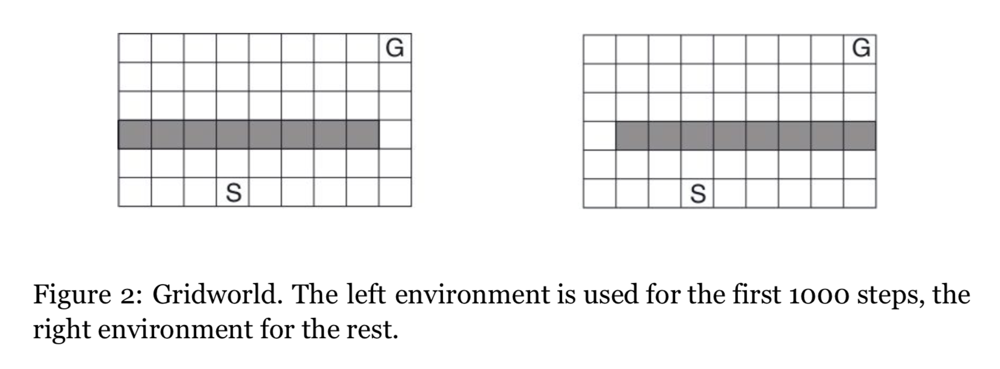
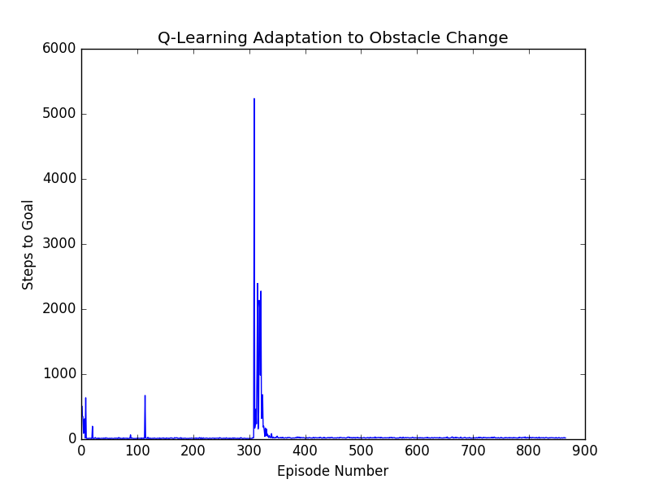
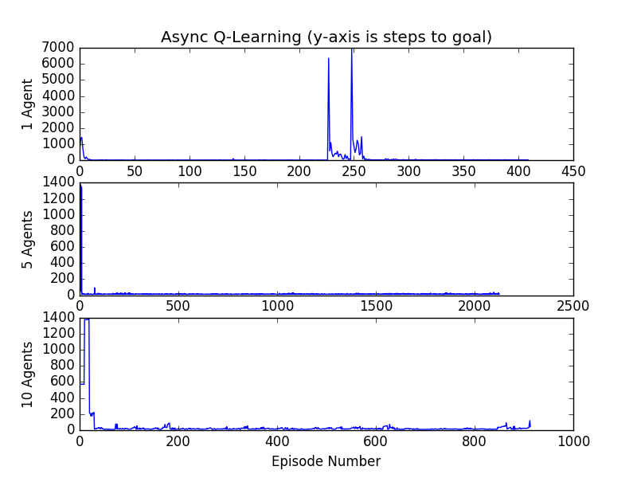

# gridworld
###### Sanctuary AI Coding Assignment

Objective is to use Q-Learning to train an agent to beat Gridworld, a 2 dimensional tile world with a start tile and a goal tile. Sometime into the learning, the obstacle shifts, as shown in figure below.



### Contents
* `README.md` you are reading me
* `main.py` main file to run experiments
* `environment.py` Gridworld environment with obstacles, start and goal states, and a reward function
* `agent.py` agent that uses Q-Learning to traverse Gridworld
* `consants.py` constants shared across environment and agent
* `tests.py` includes unit tests for deterministic functions
* `requirments.txt` required python modules and dependencies

### Installing
This repo uses `python 2.7`.
> _Note_: It is recommended that you use a [virtual environment](https://docs.python.org/3/library/venv.html) to avoid version conflicts with other python modules.

Clone or download this repo and run
```{bash}
$ pip install -t requirements.txt
```
If you do not have `pip` download it [here](https://pypi.org/project/pip/).

### Running
Use `main.py` to run experiments.
> _Note_: On macOS, or if you have `matplotlib` installed as a [framework or regular build](https://matplotlib.org/faq/osx_framework.html), you may need to run using:
> ```{bash}
> $ pythonw main.py
> ```

### Testing
To run unit tests on the environment, run
```{bash}
$ pytest tests.py
```
There is not much on the agent we can test because its update policy is simply a mathematical formula, and its behaviour is non-deterministic. The agent's progress is demonstrated statistically instead using graphs.

### Results
#### Part 1
##### Agent Successfully Learns
We set the obstacle to change at 8,000 steps instead of 1,000 so we have enough steps to demonstrate that the agent is learning, and run for 8000 steps.
As seen in the figure below, the number of steps required to get to the goal decrease over episodes. This suggests improvement in the cumulative reward function. Initially the agent takes many (~500) steps to get to the goal. Over time, the agent takes an average of 10-18 steps.


##### Agent Adapts to Obstacle Shift
We run for 40,0000 steps instead of 8,000 so that we can see the agent adapt its policy.
As seen in the figure below, there is a peak at the point when the obstacle change is introduced, and the agent must adjust its policy to be successful. Note that this would not be possible if we did not have an exploration parameter like $\epsilon$, which lets the agent pick an action at random - preventing it from getting trapped in a policy that it "thinks" is the best.



#### Part 2
I am able to demonstrate that the learning rate speeds up proportional to the number of agents, upto a point of diminishing returns - as seen in the figure below. 5 Agents is a vast improvement on 1 agent, being able to learn within the first few episodes. At 10 agents, we have slower learning. At higher agents behaviour is unpredictable.



### Recommendations
For Part 1, one can optimize the learning rate and exploration/exploitation parameters using a parameter sweep instead of guess and check like done here.

For Part 2, one should investigate the reason behind the diminishing returns after a certain number of agents. I suspect it has to do with the fact that you have too many agents saturating the possible policy corrections.

In terms of features, the next step is to add a database/storage system that can record and update the policy of an agent over a long period of time.

