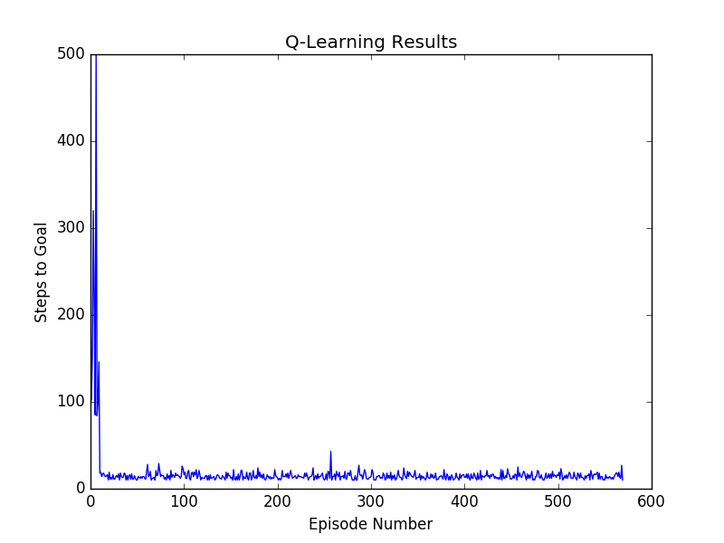

# gridworld
###### Sanctuary AI Coding Assignment

Objective is to use Q-Learning to train an agent to beat Gridworld, a 2 dimensional tile world with a start tile and a goal tile. Sometime into the learning, the obstacle shifts, as shown in figure below.


### Contents
* `README.md` you are reading me
* `main.py` main file to run experiments
* `environment.py` Gridworld environment with obstacles, start and goal states, and a reward function
* `agent.py` agent that uses Q-Learning to traverse Gridworld
* `consants.py` constants shared across environment and agent
* `requirments.txt` required python modules and dependencies

### Installing
This repo uses `python 2.7`.
> _Note_: It is recommended that you use a [virtual environment](https://docs.python.org/3/library/venv.html) to avoid version conflicts with other python modules.

Clone or download this repo and run
```{bash}
$ pip install -t requirements.txt
```
If you do not have `pip` download it [here](https://pypi.org/project/pip/).

### Running
Use `main.py` to run experiments.
> _Note_: On macOS, or if you have `matplotlib` installed as a [framework or regular build](https://matplotlib.org/faq/osx_framework.html), you may need to run using:
> ```{bash}
> $ pythonw main.py
> ```


### Results
#### Part 1
##### Agent Successfully Learns
We set the obstacle to change at 8,000 steps instead of 1,000 so we have enough steps to demonstrate that the agent is learning, and run for 8000 steps.
As seen in the figure below, the number of steps required to get to the goal decrease over episodes. This suggests improvement in the cumulative reward function. Initially the agent takes many (~500) steps to get to the goal. Over time, the agent takes an average of 10-18 steps.



##### Agent Adapts to Obstacle Shift
We run for 40,0000 steps instead of 8,000 so that we can see the agent adapt its policy.
As seen in the figure below, there is a peak at the point when the obstacle change is introduced, and the agent must adjust its policy to be successful. Note that this would not be possible if we did not have an exploration parameter like $\epsilon$, which lets the agent pick an action at random - preventing it from getting trapped in a policy that it "thinks" is the best.


